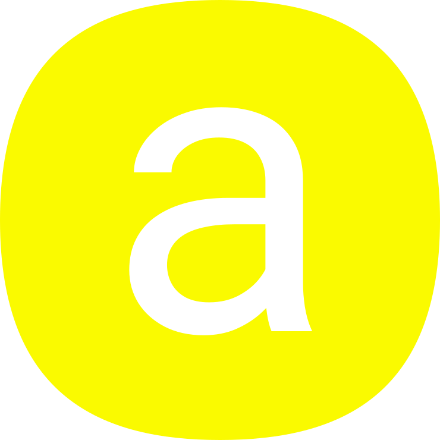

</br >
</br >

<p align='center'>
  <a target='_blank' rel='noopener noreferrer' href='#'>
    
  </a>
</p>

<h1 align='center'>amaui Icons Material Rounded React</h1>

<p align='center'>
  Amaui Icons Material Rounded for React <br />
  11k+ icon versions including 100, 400 weights, with and without the fill
</p>

<br />

<h3 align='center'>
  <sub>MIT license&nbsp;&nbsp;&nbsp;&nbsp;</sub>
  <sub>Production ready&nbsp;&nbsp;&nbsp;&nbsp;</sub>
  <sub>100% test cov&nbsp;&nbsp;&nbsp;&nbsp;</sub>
  <sub>Browser and Nodejs</sub>
</h3>

<p align='center'>
  <sub>Very simple code&nbsp;&nbsp;&nbsp;&nbsp;</sub>
  <sub>Modern code&nbsp;&nbsp;&nbsp;&nbsp;</sub>
  <sub>Junior friendly&nbsp;&nbsp;&nbsp;&nbsp;</sub>
  <sub>Typescript&nbsp;&nbsp;&nbsp;&nbsp;</sub>
  <sub>Made with :yellow_heart:</sub>
</p>

<br />

## Getting started

### Add

```sh
  yarn add @amaui/icons-material-react
```

### Use

```javascript
  // Import any of the icons
  // best to import them as modules like this example
  // it's the most efficient way to import icons
  import IconMaterialPottedPlantRounded from '@amaui/icons-material-rounded-react/IconMaterialPottedPlant';

  function A(props) {

    return (
      // 🪴
      <IconMaterialPottedPlantRounded />
    );
  }
```

### Dev

Install

```sh
  yarn
```

Test

```sh
  yarn test
```

### Prod

Build

```sh
  yarn build
```

### Licenses

[Google material design icons](https://fonts.google.com/icons) are ones used in this repository, licenced under their own [licence](https://github.com/google/material-design-icons/blob/master/LICENSE).

Updates made to original icons:
- A part of the icons are used not all of them.
- Inner svg elements (children) are extracted from every icon, and put within the @amaui/ui-react Icon component as children.
- Every icon from there is made into it's own React component as part of this UI library.
